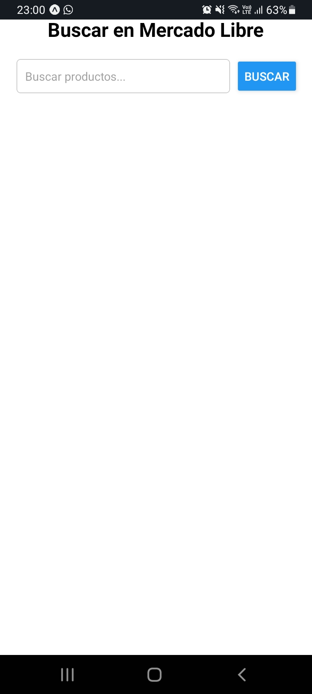
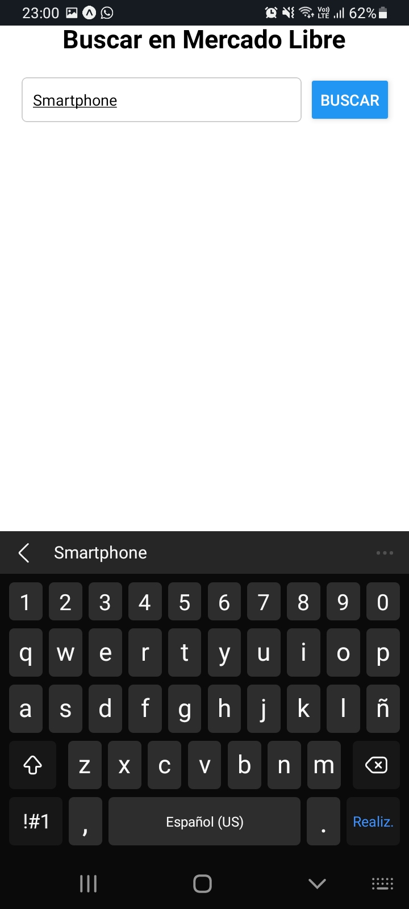
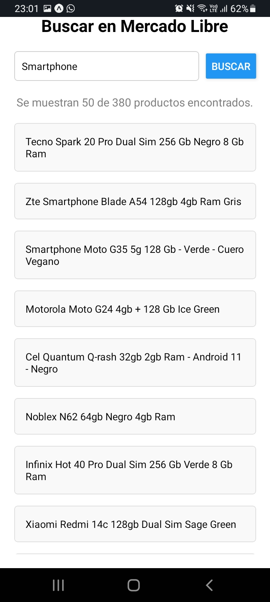

# Aplicación Móvil de Demonstración
*App de búsqueda en Mercado Libre*

Esta aplicación es una herramienta sencilla desarrollada en **React Native** que permite buscar productos de Mercado Libre a través de su API. Los usuarios pueden ingresar un término de búsqueda, realizar la consulta y visualizar los productos encontrados en una lista.

## Tecnologías utilizadas
- **React Native:** Framework para construir aplicaciones móviles.
- **JavaScript (ES6+):** Lenguaje principal utilizado.
- **API de Mercado Libre:** Fuente de datos para las búsquedas de productos.
- **Expo:** Plataforma que facilita el desarrollo y prueba de aplicaciones React Native sin configuraciones complejas.

## Características principales
1. **Búsqueda de productos:**
  - Campo de texto para ingresar el término de búsqueda.
  - Botón para ejecutar la consulta.
2. **Resultados en lista:**
  - Visualiza los productos encontrados con su título y precio
3. **Notificaciones de estado:**
  - Mensajes informativos sobre el estado de la búsqueda (ej. "Buscando productos...", "No se encontraron productos", etc.).
4. **Indicador de carga:**
  - Un spinner se muestra mientras se espera la respuesta de la API.
5. **Validación de errores:**
  - Manejo de errores en caso de problemas con la conexión o respuestas inválidas de la API.

## Requisitos previos
- Tener instalado **Node.js** (v14 o superior).
- Tener instalado **npm** o **yarn**.
- Tener **Expo Go** en el dispositivo móvil (disponible en Google Play Store o App Store).

## Instalación y configuración
1. Clona el repositorio:
```bash
git clone https://github.com/MauroCamerini/demo-mobile-app.git
cd demo-mobile-app
```
2. Instala las dependencias:
```bash
npm install
# o
yarn install
```
3. Inicia el servidor de desarrollo:
```bash
npx expo start
```
4. Escanea el código QR:
	- Utiliza la app **Expo Go** en tu dispositivo para escanear el código QR mostrado en la terminal o en el navegador.

## Uso

1. Abre la aplicación en tu dispositivo.
2. Escribe un término de búsqueda en el campo de texto (por ejemplo: "smartphone").
3. Presiona el botón Buscar.
4. Espera los resultados mientras se muestra el indicador de carga.
5. Visualiza la lista de productos encontrados.

## Capturas de pantalla

### Pantalla principal


### Ingresar búsqueda


### Ver resultados
